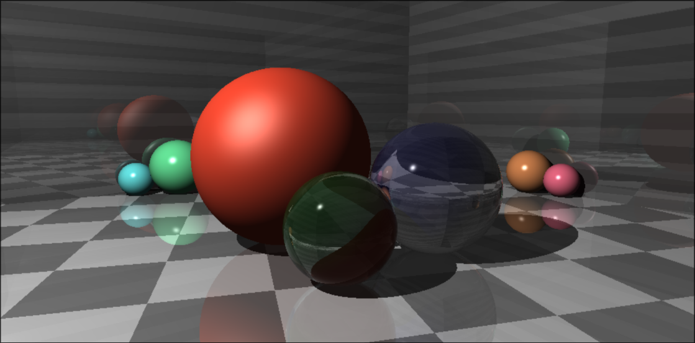
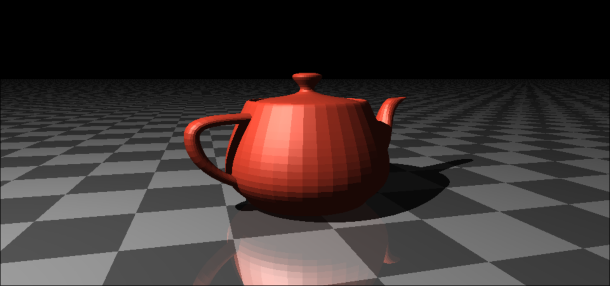

## CPU-based Ray Tracer

Project is a C++17 implementation of a ray tracer. Guidance was used from the [Ray Tracing Challenge](http://raytracerchallenge.com/).
Everything was written from scratch, so no external libraries are used other than [`Catch2`](https://github.com/catchorg/Catch2) for testing.

I wanted to do this, so I can:
 - relearn some concepts that I explored in computer graphics
 - do some performance engineering!
    - I used `perf`, `valgrind`, `flamegraph`, `hyperfine`!
    - caching the inverse matrix improved program speed by insane amounts
 - learn and use C++17
 - use Nix for a C++ project!

## Getting Started

### Prerequisites

This project requires `cmake` and `catch2`, so be so to have those installed.
This project has been set up using `Nix`, so if you have it installed, you can
easily use `nix develop` and have the environment I used to build this project.

### Building

Run `make debug` or `make release` to build debug or release binaries
respectively in a `build` folder. You can also use `cmake` to generate a way to
build this project in a way you want.

### Running

There are two targets that are generated: `tester` and `Rt`. Both currently
needs to be run in top most directory as it references relative paths in `obj`.
That should be changed in the future, but I didn't want to deal with it.

`tester` just runs tests. `Rt` prints to `stdout` the contents of a `ppm` file.
Redirect the output to save it. Right now, `Rt` just renders a scene described
in `src/rt.cpp`. The rendered scenes are currently hardcoded instead of being
configurable, so rendering another scene requires changing `src/rt.cpp` and
recompiling. Hopefully, I will change that in the future.

## Improvements that I can do

- Configurable way to render different scenes without recompiling
- Read from some data format or DSL to render different scenes
- Multithreading
- Webassembly, so you can see some renders on the web
- SIMD/AVX2 optimizations for my math primitives
- BVH (Bounding volume hierarchy)
- CSG (Constructive solid geometry)
- Adding more patterns

## Sample images

####  Balls

#### Teapot

